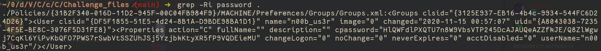

# can_you_c_the_password?
- grep the password from given files as follows:
```sh
grep -Ri password .
```


- We notice an interesting result as follows:
    ```
    cpassword="HlQWFdlPXQTU7n8W9VbsVTP245DcAJAUQeAZZfkJE/Q8ZlWgwj7CqKl6YiPvKbQFO7PWS7rSwbVtSSZUhJSj5YzjbkKtyXR5fP9VQDEieMU"
    ```
- google `cpassword decrypt` , and we get multiple articles talking about difference ways of cracking this!
    - Article explaining what's what?: https://www.hackingarticles.in/credential-dumping-group-policy-preferences-gpp/
    - Docs by Microsoft giving the required key(if you wanna go old school and make a script): https://docs.microsoft.com/en-us/openspecs/windows_protocols/ms-gppref/2c15cbf0-f086-4c74-8b70-1f2fa45dd4be?redirectedfrom=MSDN

- Method_1: Perl tool called `gpp-decrpyt` (Avaiable in major linux distributions, and can be installed through your package managers)
- Method_2: Python2 script: (https://github.com/leonteale/pentestpackage/blob/master/Gpprefdecrypt.py)

```py
#!/usr/bin/python
#
# Gpprefdecrypt - Decrypt the password of local users added via Windows 2008 Group Policy Preferences.
#
# This tool decrypts the cpassword attribute value embedded in the Groups.xml file stored in the domain controller's Sysvol share.
#

import sys
from Crypto.Cipher import AES
from base64 import b64decode

if(len(sys.argv) != 2):
  print "Usage: gpprefdecrypt.py <cpassword>"
  sys.exit(0)

# Init the key
# From MSDN: http://msdn.microsoft.com/en-us/library/2c15cbf0-f086-4c74-8b70-1f2fa45dd4be%28v=PROT.13%29#endNote2
key = """
4e 99 06 e8  fc b6 6c c9  fa f4 93 10  62 0f fe e8
f4 96 e8 06  cc 05 79 90  20 9b 09 a4  33 b6 6c 1b
""".replace(" ","").replace("\n","").decode('hex')

# Add padding to the base64 string and decode it
cpassword = sys.argv[1]
cpassword += "=" * ((4 - len(sys.argv[1]) % 4) % 4)
password = b64decode(cpassword)

# Decrypt the password
o = AES.new(key, AES.MODE_CBC, "\x00" * 16).decrypt(password)

# Print it
print o[:-ord(o[-1])].decode('utf16')
```
