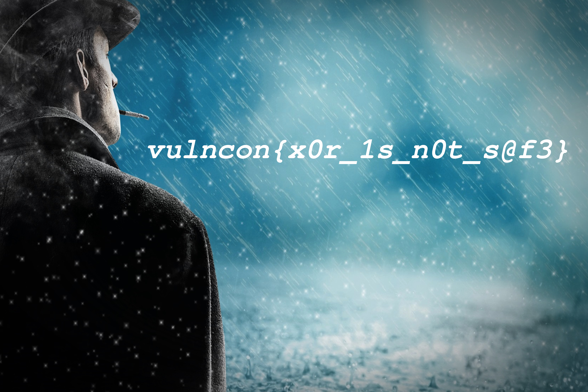

# is_it_magic?
- Challenge name and description point to using magic bytes(`of a jpg file, evident from challenge files`) with xor!
- Approach to solve the challenge:
    - Get key by doing `first 24 bytes of encrpyted jpg` XOR `24 bytes of any normal jpg`.
        - Why 24? That's the longest standard bytes for any jpg and you were supposed to figure that out!
    - Use the same key for all the bytes in encrypted image and get a new image.

##### Note: I know, there are multiple ways to perform above steps. Below script is to just understand the process better :)

```py
from binascii import hexlify, unhexlify
from itertools import cycle

def gen_key(message):
    jpg_magic_bytes = 'ff d8 ff e0 00 10 4a 46 49 46 00 01'.split()
    xored_header = []

    for i in range(0, len(message[:24]), 2):
        xored_header.append(message[i]+message[i+1])

    return bytes.fromhex(''.join(hex(int(a, 16)^int(b, 16))[2:] for a,b in zip(jpg_magic_bytes, xored_header)))

def do_xor(message):
    key = gen_key(message)
    message = bytes.fromhex(message)
    return bytes(x ^ y for x, y in zip(message, cycle(key))).hex()

with open('smokeaway.jpg.enc', 'rb') as f:
    message  = f.read()
    message = hexlify(message).decode().replace('\n', '')
f.close()

with open('smokeaway.jpg', 'wb') as i:
    i.write(unhexlify(do_xor(message)))
i.close()
```

- Output

